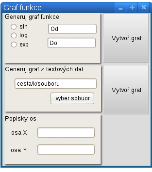
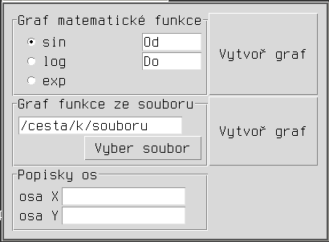

# PRG -- Graf funkce

<https://mamut.spseol.cz/nozka/python/priklad_graf/>

Vytvořte aplikaci pro generování grafů matematických funkcí.
Aplikace bude mít tyto volby:

1. Graf matematické funkce.
  * Uživatel bude mít na výběr mezi několika funkcemi.
  * Uživatel zadává mezní hodnoty.
2. Graf funkce z hodnot uložených v textovém souboru.
  * V souboru jsou na každém řádku vždy dvě čísla oddělená libovolným počtem mezer.
  * Levé číslo udává souřadnici na ose X, pravé číslo udává souřadnici na ose Y.

## Soubory s grafy:

* [fce.txt -- UNIX konce řádků](fce.txt)
* [fce.txt -- DOS konce řádků](fce-dos.txt)

## Inspirace pro GUI

## Nápověda a dokumentace

* <https://mamut.spseol.cz/nozka/python/priklad_graf/>

* <http://tkinter.programujte.com/tkinter-standard-dialogs.htm>
* <http://tkinter.programujte.com/tkinter-dialog-entry.htm>
* <http://infohost.nmt.edu/tcc/help/pubs/tkinter/web/index.html>
* <http://tkinter.unpythonic.net/wiki/tkFileDialog>
* <http://www.py.cz/TkinterSouboryAdresare>
* <http://infohost.nmt.edu/tcc/help/pubs/tkinter/web/tkFileDialog.html>
* <http://infohost.nmt.edu/tcc/help/pubs/tkinter/web/tkMessageBox.html>
